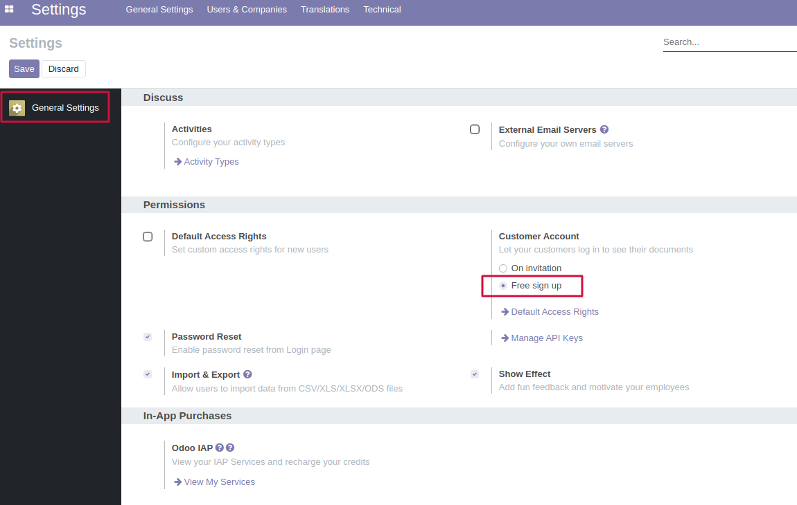
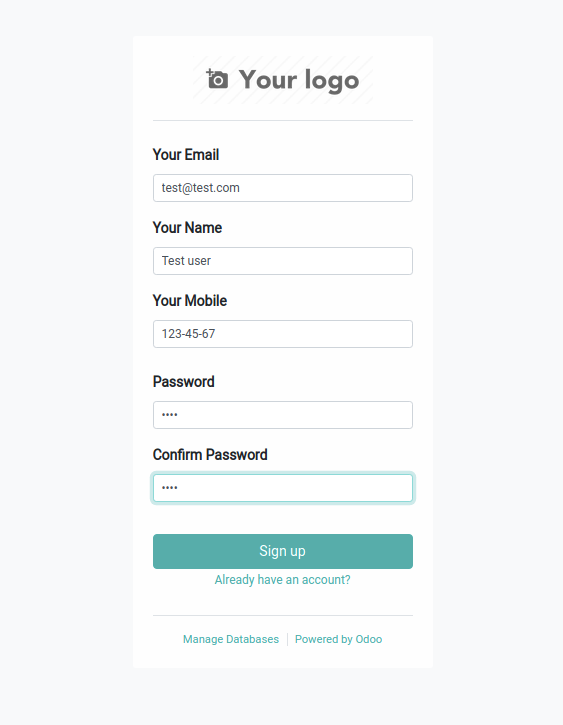
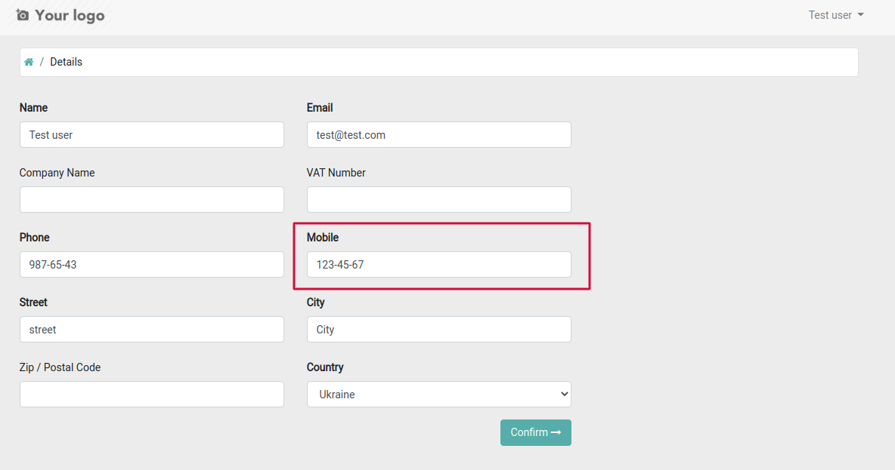
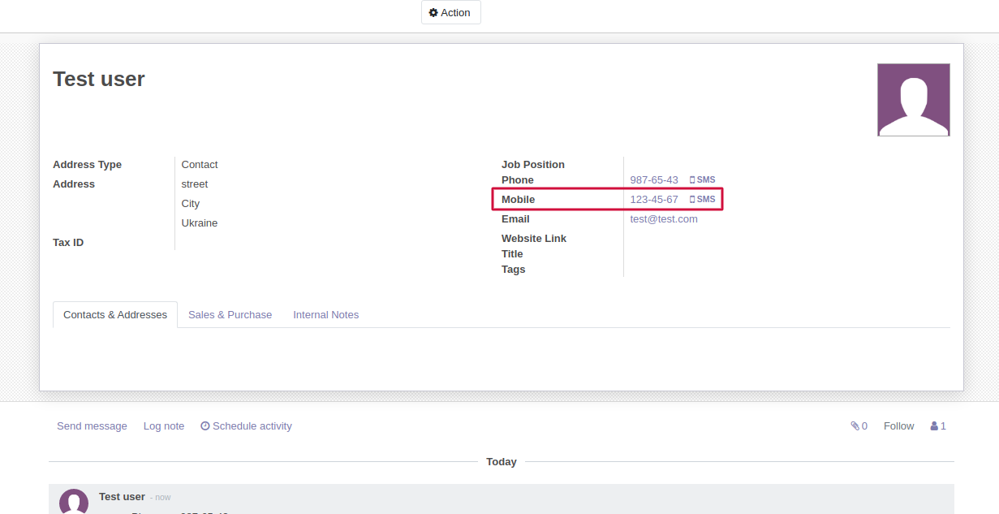

==================
Mobile for signup
==================

**For correct setting:**

#. Go to 'Settings' > 'General Settings'
#. In the "Permissions" section, for the 'Customer Account' item, select "Free sign up".

**Detail**

**This module add field 'Mobile' to Authorization and 'Account detail' forms.**

**Of course, it can be edited from the Account detail form on the portal.**

**When registering a user, the Mobile field is filled in the partner related with the user.**

